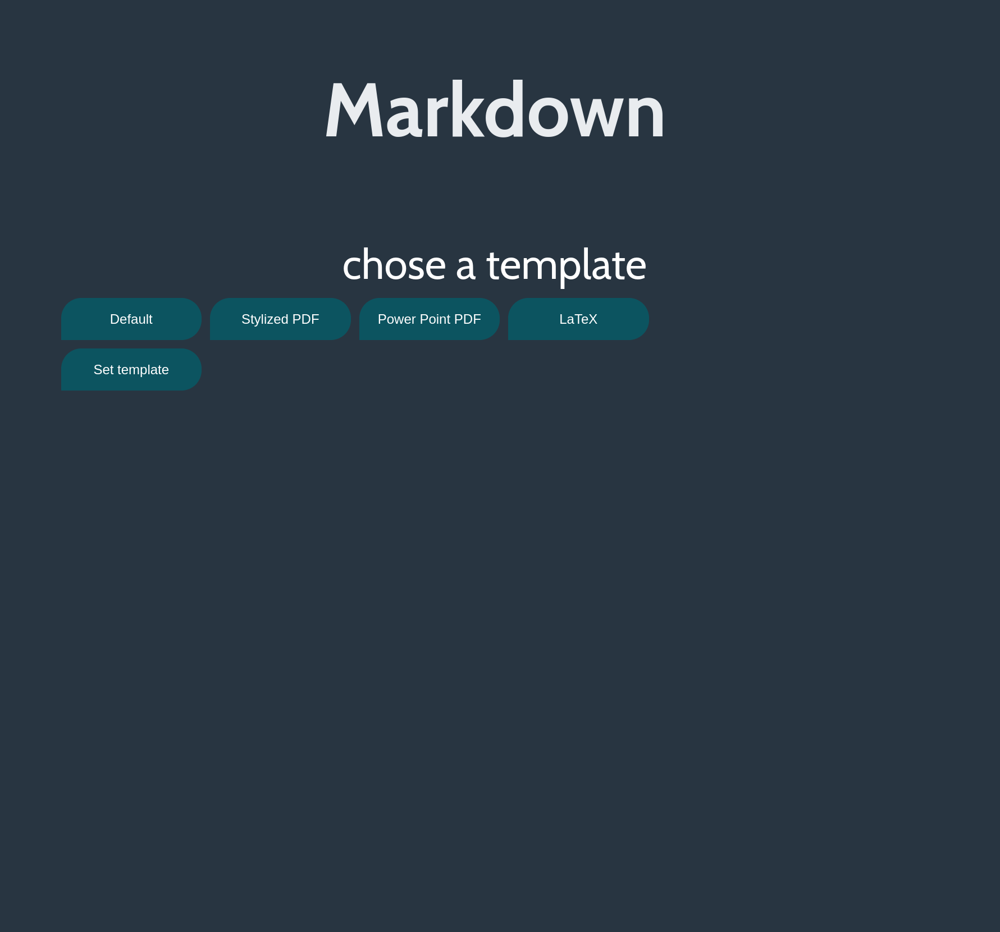
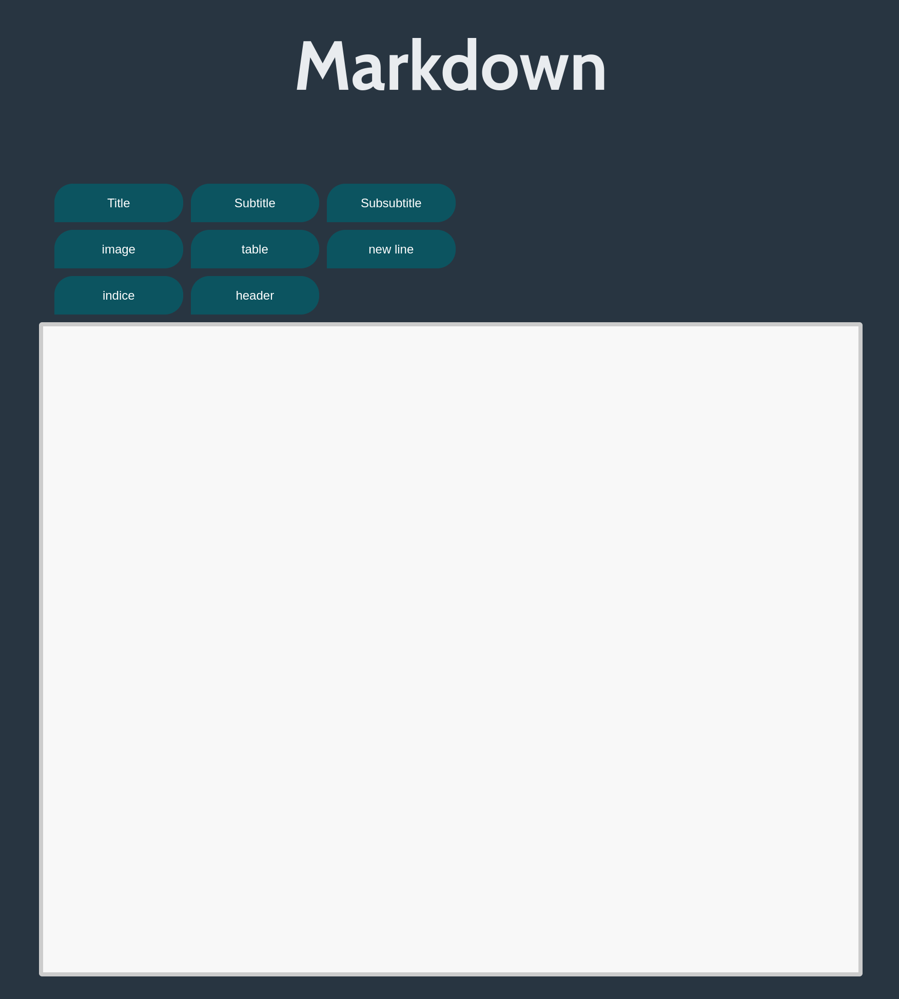
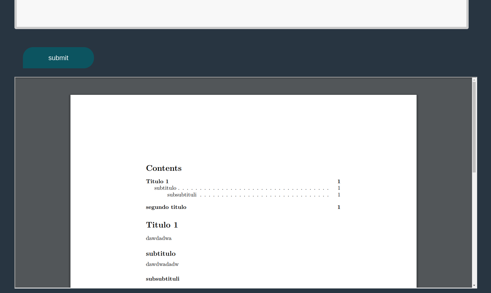
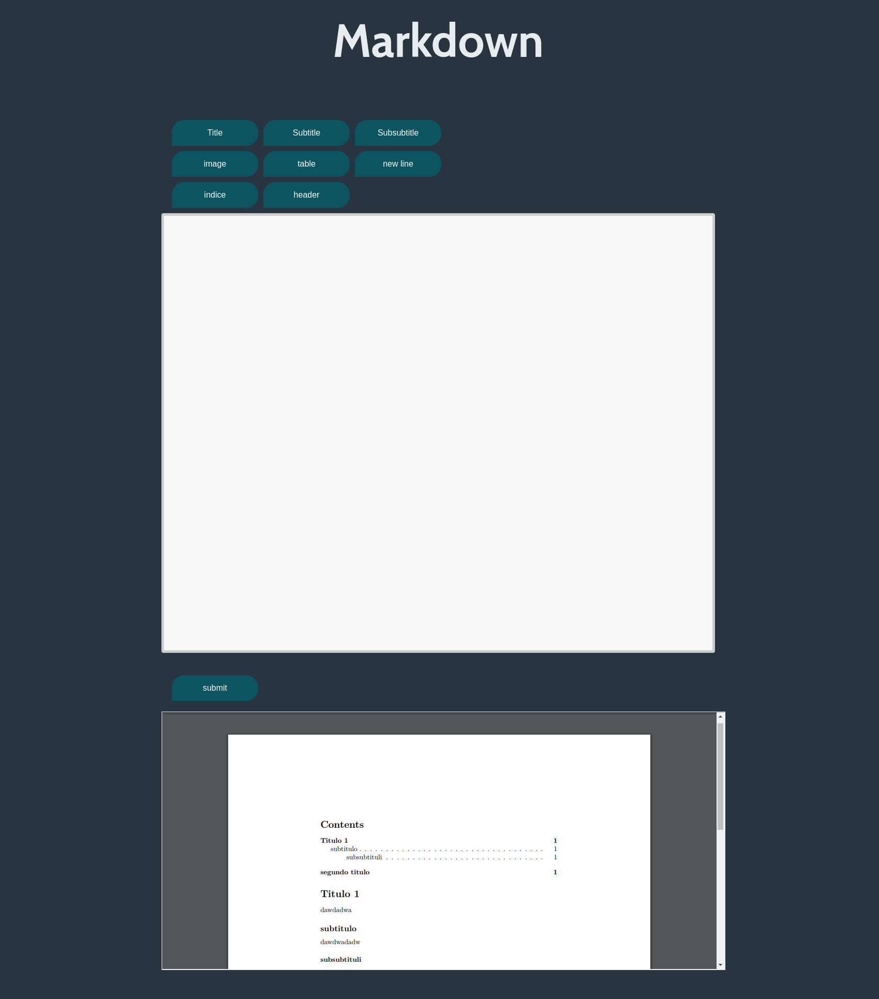

# MARKDWON UI

[Dep]
1. Install python3 and pip
    - sudo apt install python3-pip

2. Install Chrome or Chromium
    - sudo apt-get install chromium-browser

3. Install pandoc
    - sudo apt install pandoc

4. Install pdflatex
    - sudo apt install texlive-full

5. Install zathura (PDF Reader)
    - sudo apt install zathura

6. Install texlive 
    - sudo apt-get install texlive-full

4. Move the template `eisvogel.tex` to your pandoc templates folder and rename the file to `eisvogel.latex`. The location of the templates folder depends on your operating system:
	- Unix, Linux, macOS: `$XDG_DATA_HOME/pandoc/templates` or `~/.pandoc/templates/`
	- Windows XP: `C:\Documents And Settings\USERNAME\Application Data\pandoc\templates`
	- Windows Vista or later: `C:\Users\USERNAME\AppData\Roaming\pandoc\templates`

[Modules]
1. Install eel
    pip3 install eel

